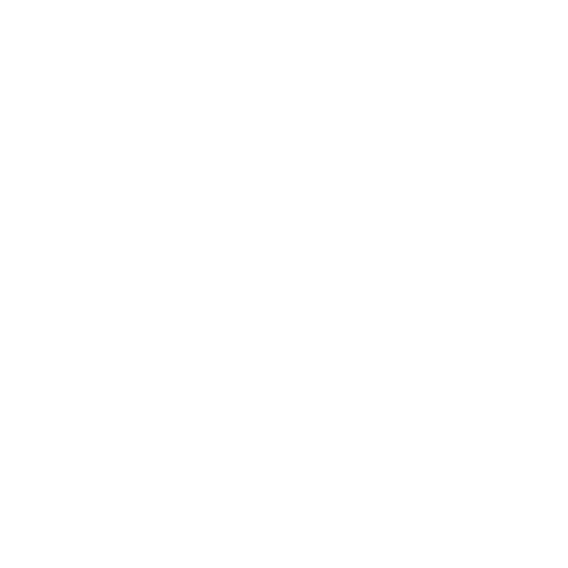
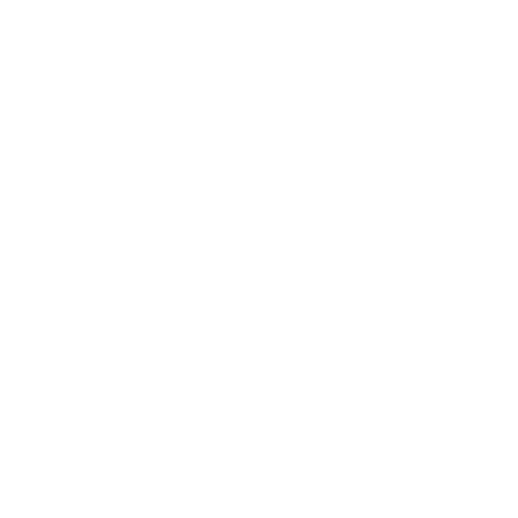
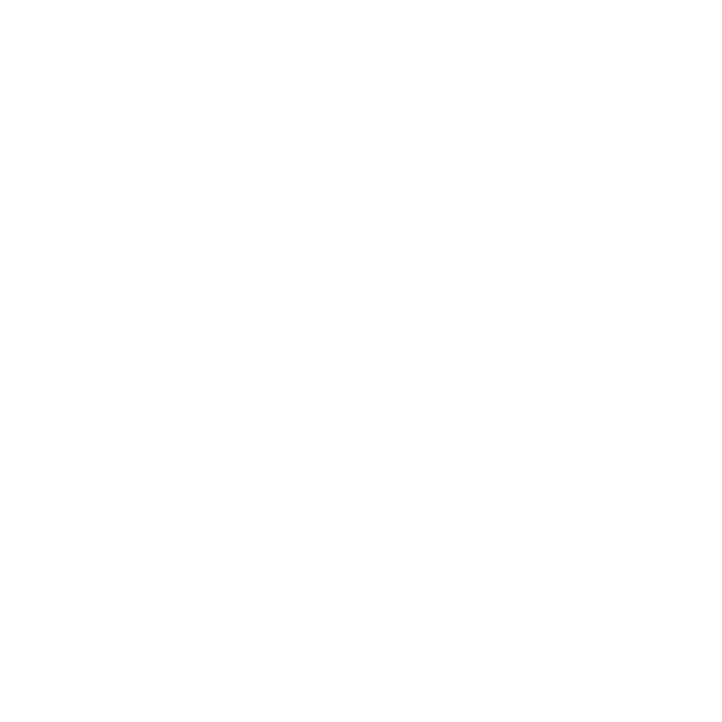
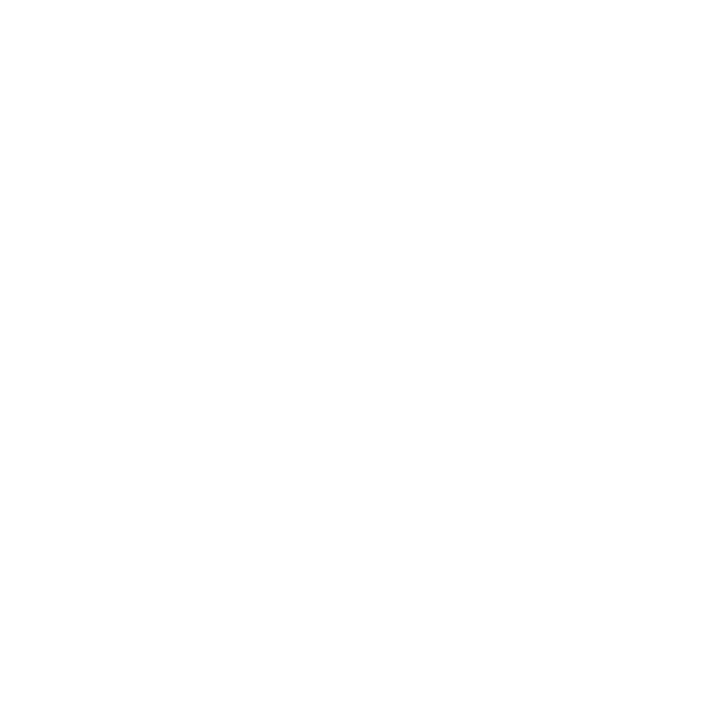

<style>
    @import url('https://fonts.googleapis.com/css2?family=Google+Sans:ital,opsz,wght@0,17..18,400..700;1,17..18,400..700&display=swap');

    * {
        font-family: "Google Sans", sans-serif;
        font-size: 14px;
    }

    .title-card {
        text-align: center;
        padding: 2%;
        background-color: #201e24;
        border: solid 2px #323038ff;
        border-radius: 14px;
    }

    .title-card .title-size {
        font-size: 32px;
        font-weight: bold;
    }

    .btn-container {
        margin: 2%;
        text-align: center;
    }

    .btn-container .btn {
        color: white;
        border: none;
        padding: 1.5%;
        padding-left: 32px;
        font-weight: bold;
        margin: 1%;
        border-radius: 5px;
    }

    .btn img {
        position: absolute;
        top: 50%;
        left: 18px;
        transform: translate(-50%, -50%);
    }

        #linked-in {
            position: relative;
            background-color: #008cffff;
        }

        #github {
            position: relative;
            background-color: #201e24;
        }

        #contact {
            position: relative;
            color: black;
        }

        #html {
            position: relative;
            background-color: #ff7b00ff;
        }

        #css {
            position: relative;
            background-color: #008cffff;
        }

        #scss {
            position: relative;
            background-color: #ff0062ff;
        }

        #bootstrap {
            position: relative;
            background-color: #8400ffff;
        }

        #javascript {
            position: relative;
            color: black;
            background-color: #ffd900ff;
        }

        #python {
            position: relative;
            color: black;
            background-color: #ffd900ff;
        }

        #pytorch {
            position: relative;
            background-color: #ff7b00ff;
        }

        #lua {
            position: relative;
            background-color: #00026eff;
        }
    
    .center-container {
        text-align: center;
    }
</style>

<div class="title-card">
    <div class="title-size">William Santos de Santana</div>
    <p>Estudante de Ciências da Computação | Front-end | Design UX</p>
</div>

<div class="btn-container">
    <a href="https://www.linkedin.com/in/williamsantos08/"><button type="button" class="btn" id="linked-in"> LinkedIn</button></a>
    <a href="https://github.com/WillSantos08"><button type="button" class="btn" id="github"> GitHub</button></a>
    <a href="mailto:william.santana2@outlook.com"><button type="button" class="btn" id="contact">Contact</button></a>
</div>

#

```
🎓 Estudante de Ciência da Computação;
💻 Apaixonado por desenvolvimento Front-end e UI/UX;
🎨 Experiência com design gráfico e interfaces;
📚 Sempre aprendendo algo novo;
```

<h2>🔗 Linguagens e Tecnologias</h2>
<div class="btn-container">
    <button type="button" class="btn" id="html">HTML</button>
    <button type="button" class="btn" id="css">CSS</button>
    <button type="button" class="btn" id="scss">SASS</button>
    <button type="button" class="btn" id="bootstrap">Bootstrap</button>
    <button type="button" class="btn" id="javascript">JavaScript</button>
    <button type="button" class="btn" id="python">Phyton</button>
    <button type="button" class="btn" id="pytorch">PyTorch</button>
    <button type="button" class="btn" id="lua">LuaScript</button>
</div>

#

<div class="center-container">
    <a href="https://open.spotify.com/user/themarionette08">
    
    </a>
</div>

#
<div class="center-container">
    
    
</div>

#

<div class="center-container">
    <p>© William Santos, 2025</p>
</div>